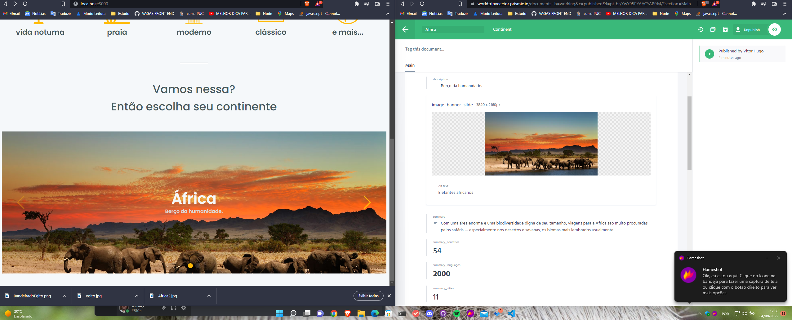

This is a [Next.js](https://nextjs.org/) project bootstrapped with [`create-next-app`](https://github.com/vercel/next.js/tree/canary/packages/create-next-app).

## Getting Started

First, run the development server:

```bash
npm run dev
# or
yarn dev
```

## PRISMIC CMS IMPLEMENTATION FEATURES

> ### Creating Client
````
const endpoint = 'https://worldtripveector.prismic.io/api/v2'
const accessToken = 'your-access-token-here'

prismic = Prismic.createClient(endpoint, { accessToken })

export { prismic }
````
`It's recommended to create the client in a separate file (or also even inside a factory method), so that you don't need to create it every time you want to query data.`

Open [http://localhost:3000](http://localhost:3000) with your browser to see the result.

# Worldtrip -> NextJS, TypeScript and PrismicIO

- Sass
- ChakraUI
- NextJS
- ReactJS
- TypeScript
- CleanCode
- PrismicIO (Working with CMS)


PrismicIO 

View 

Responsivity from head to toe 

PrismicIO 

View 

Responsivity from head to toe 